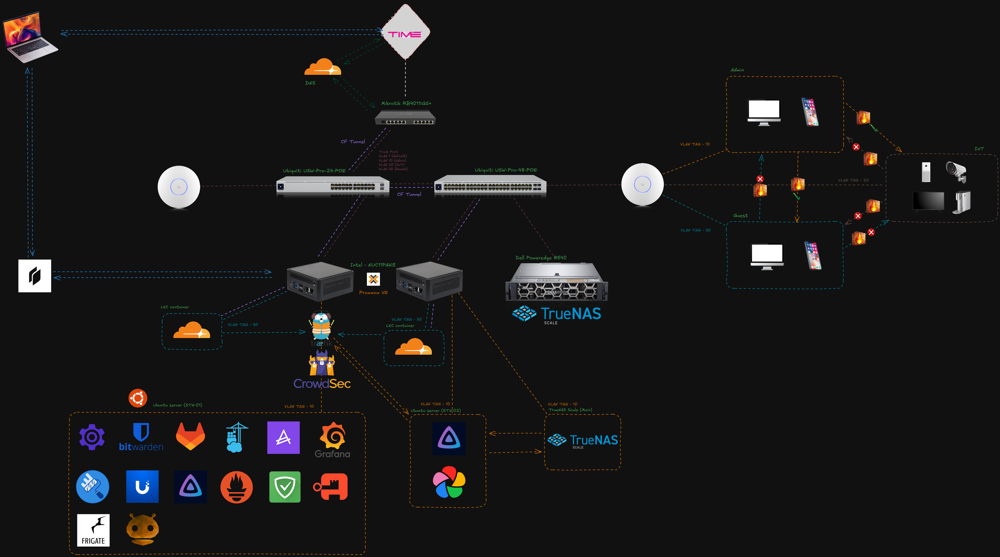
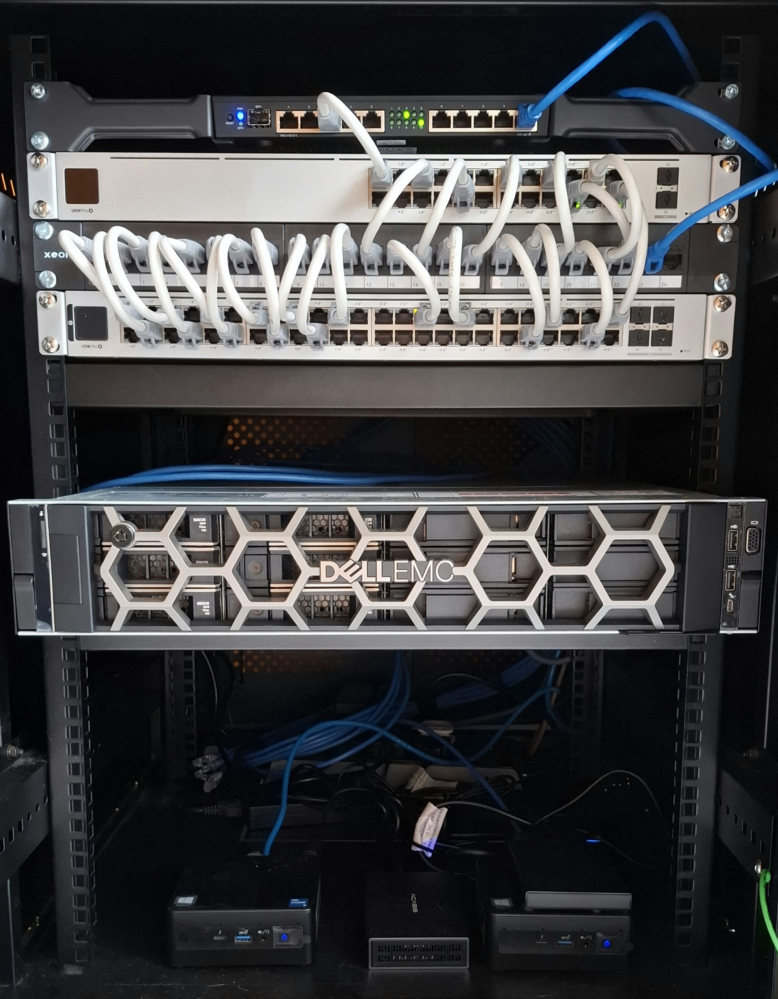

I’ve been building and refining my homelab as a system administrator. What started as curiosity has become a hands-on platform to experiment with infrastructure, security, automation, and self-hosted services.

🌐 Networking
On the networking side, I’m using a MikroTik RB4011iGS+ as my primary DHCP server and firewall, handling VLAN segmentation and firewall rules. Switching is handled by Ubiquiti USW 24 PoE Pro and USW 48 PoE Pro switches, all managed via a self-hosted UniFi Controller.

🖥️ Hardware Setup
2× Intel NUC servers - i5 11th Gen, 24GB RAM
1× Dell R540 - Intel Xeon Silver 4210R, 64GB RAM

🔧 Architecture Overview
NUC #1 – Core Services & Applications
This is my main application node, focused on security, automation, and observability:
1. Traefik – Reverse proxy, load balancing, HTTPS reroute, SSL certificate
2. CrowdSec (WAF) – Protecting web applications
3. GitLab – Version control & CI/CD automation pipelines
4. Teleport – Secure access to self-hosted applications
5. Portainer – Docker container management
6. Dozzle – Real-time Docker log monitoring
7. AdGuard Home – DNS server, Ad filtering with DoT/DoH upstream
8. Grafana – Monitoring and visibility across servers
9. Twingate - Zero trust tunnel access
10. Bitwarden - Password manager

NUC #2 – Storage & Media
Dedicated to storage and personal data services:
1. TrueNAS (Main) – Centralized storage
2. Jellyfin – Home media server
3. Immich – Self-hosted photo & gallery backup

Dell R540 - TrueNAS (Backup)
To sync with NUC #2 Truenas (Main) for data protection

🐳 Container Platform Journey
At the moment, all workloads are running on Docker. Over time, I’ve also experimented with Docker Swarm and Kubernetes, and I’m now planning a gradual migration toward Kubernetes to better align with cloud-native architectures and concepts such as ingress management, persistent volume claims, and declarative deployments with scalable workloads.
